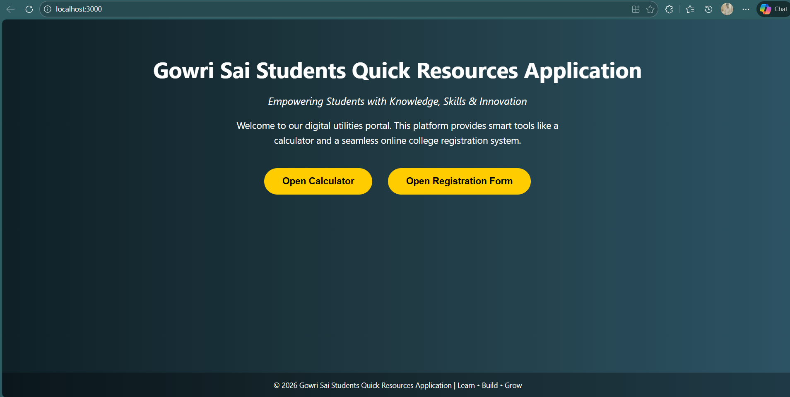
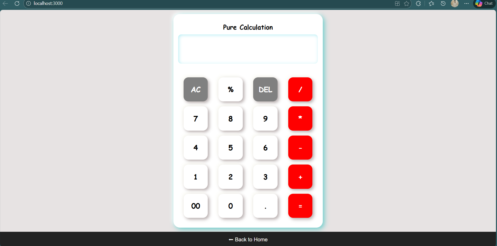
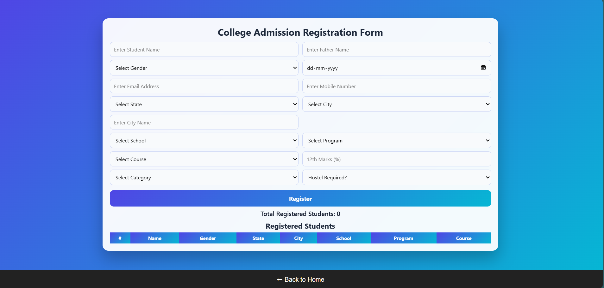

# 🎓 College Utilities Portal – React Application

This project is a **React-based web application** that provides a clean and interactive **college utilities portal**.  
It includes:

- 🧮 A Calculator application  
- 📝 A College Registration Form  
- 🏠 A professional intro (home) page with slogans and navigation  

The Calculator and Registration Form are **existing HTML, CSS, and JavaScript projects**, embedded into React using **iframe integration (Approach 1)**.

---

## 🌟 Features

- 📌 Beautiful **intro / landing page**
- 🧮 Calculator opens on full page
- 📝 College registration form opens on full page
- 🔙 Back button to return to home page
- 📱 Fully responsive (desktop, tablet, mobile)
- ⚛️ Built using React without modifying existing DOM-based projects
- 🧱 Clean layout with footer fixed at bottom

---

## 🛠️ Technologies Used

- **React.js**
- **HTML5**
- **CSS3**
- **JavaScript**
- **Git & GitHub**

---
react-calculator-registration/
│
├── public/
│ ├── calculator/
│ │ ├── index.html
│ │ ├── style.css
│ │ └── script.js
│ │
│ └── registration/
│ ├── index.html
│ ├── style.css
│ └── script.js
│
├── src/
│ ├── App.js
│ └── index.js
│
├── .gitignore
├── package.json
└── README.md


---

## ▶️ How to Run the Project Locally

### 1️⃣ Clone the repository
```bash
git clone https://github.com/KunchapuGowriSai/react-calculator-registration.git
2️⃣ Go to project folder
cd react-calculator-registration

3️⃣ Install dependencies
npm install

4️⃣ Start the React app
npm start


Open browser and visit:

http://localhost:3000
🖼️ Output Screenshots

🏠 Home Page


🧮 Calculator Page


📝 Registration Page



📌 Approach Used
✅ Approach 1 – Embedding Existing HTML/JS into React

Existing Calculator and Registration projects were not rewritten

They are embedded using iframe

Ensures DOM-based JavaScript works without conflicts

Best for legacy project integration

🚀 Future Enhancements

React Router based navigation

Animated transitions between pages

Form validation using React

Database integration

Authentication system

👨‍💻 Author

Kunchapu Gowri Sai
B.Tech – Computer Science & Engineering (AI & ML)
GitHub: KunchapuGowriSai
## 📂 Project Structure

